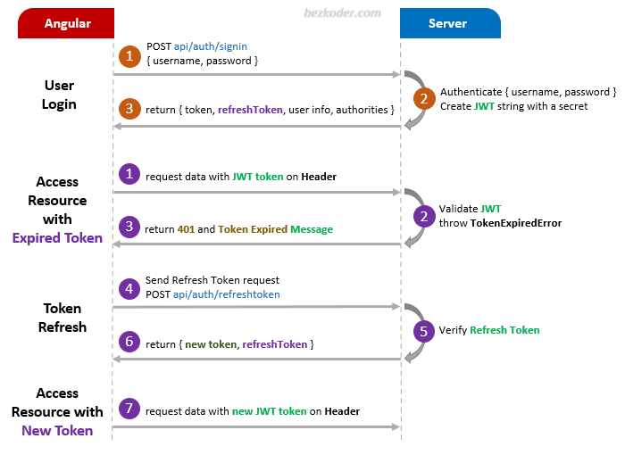

# Angular 14 JWT Refresh Token example with Http Interceptor

Implementing Angular 14 Refresh Token before Expiration with Http Interceptor and JWT.
You can take a look at following flow to have an overview of Requests and Responses that Angular 14 Client will make or receive.

## Angular JWT Refresh Token Flow

For more detail, please visit:
> [Angular 14 Refresh Token with Interceptor and JWT example](https://www.bezkoder.com/angular-14-refresh-token/)

> [Angular 14 JWT Authentication & Authorization with Web API example](https://www.bezkoder.com/angular-14-jwt-auth/)

## Fullstack
> [Angular 14 + Spring Boot: JWT Authentication and Authorization example](https://www.bezkoder.com/angular-14-spring-boot-jwt-auth/)

> [Angular 14 + Node.js Express: JWT Authentication and Authorization example](https://www.bezkoder.com/node-js-angular-14-jwt-auth/)

Run `ng serve --port 8081` for a dev server. Navigate to `http://localhost:8081/`.

## More practice
> [Angular CRUD example with Web API](https://www.bezkoder.com/angular-14-crud-example/)

> [Angular Pagination example](https://www.bezkoder.com/angular-14-pagination-ngx/)

> [Angular File upload example with Progress bar](https://www.bezkoder.com/angular-14-file-upload/)

Fullstack with Node:

> [Angular + Node Express + MySQL example](https://www.bezkoder.com/angular-14-node-js-express-mysql/)

> [Angular + Node Express + PostgreSQL example](https://www.bezkoder.com/angular-14-node-js-express-postgresql/)

> [Angular + Node Express + MongoDB example](https://www.bezkoder.com/mean-stack-crud-example-angular-14/)

> [Angular + Node Express: File upload example](https://www.bezkoder.com/angular-14-node-express-file-upload/)

Fullstack with Spring Boot:

> [Angular + Spring Boot + H2 Embedded Database example](https://www.bezkoder.com/spring-boot-angular-14-crud/)

> [Angular + Spring Boot + MySQL example](https://www.bezkoder.com/spring-boot-angular-14-mysql/)

> [Angular + Spring Boot + PostgreSQL example](https://www.bezkoder.com/spring-boot-angular-14-postgresql//)

> [Angular + Spring Boot + MongoDB example](https://www.bezkoder.com/spring-boot-angular-14-mongodb/)

> [Angular + Spring Boot: File upload example](https://www.bezkoder.com/angular-14-spring-boot-file-upload/)

Fullstack with Django:
> [Angular + Django example](https://www.bezkoder.com/django-angular-13-crud-rest-framework/)

Serverless with Firebase:
> [Angular 14 Firebase CRUD with Realtime DataBase](https://www.bezkoder.com/angular-14-firebase-crud/)

> [Angular 14 Firestore CRUD example](https://www.bezkoder.com/angular-14-firestore-crud/)

> [Angular 14 Firebase Storage: File Upload/Display/Delete example](https://www.bezkoder.com/angular-14-firebase-storage/)

Integration (run back-end & front-end on same server/port)
> [How to integrate Angular with Node Restful Services](https://www.bezkoder.com/integrate-angular-12-node-js/)

> [How to Integrate Angular with Spring Boot Rest API](https://www.bezkoder.com/integrate-angular-12-spring-boot/)
